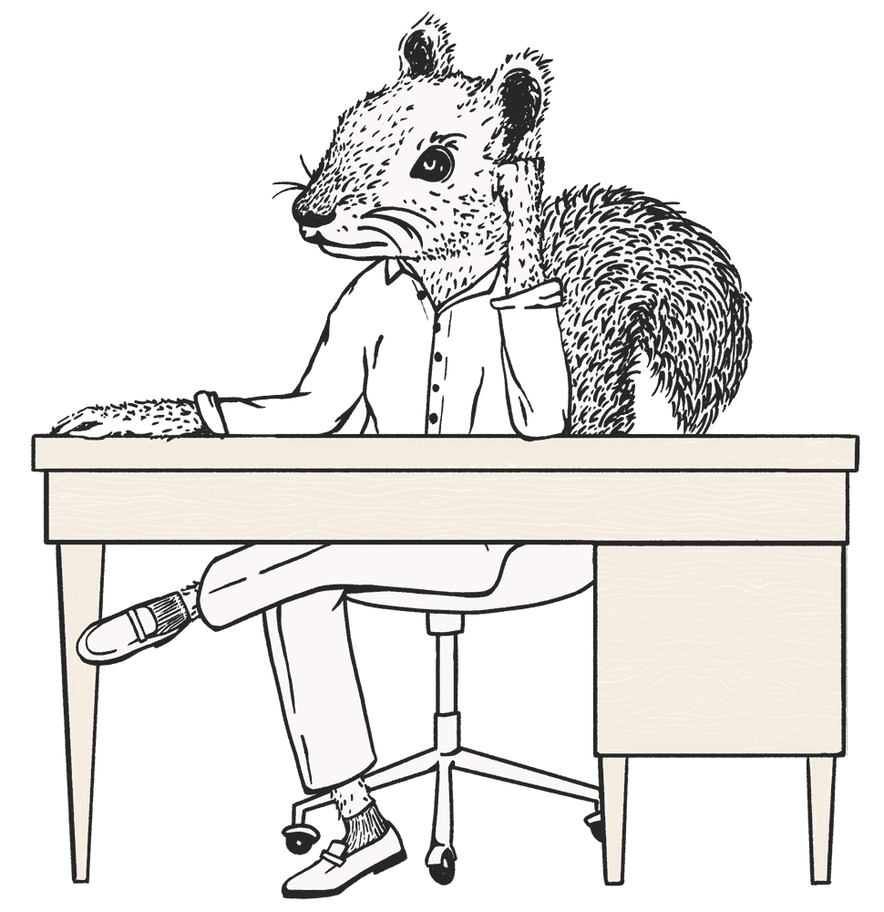
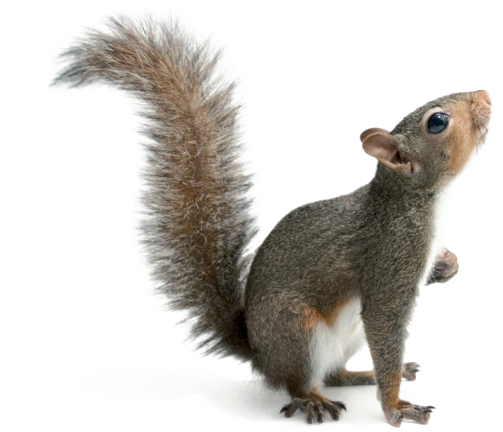
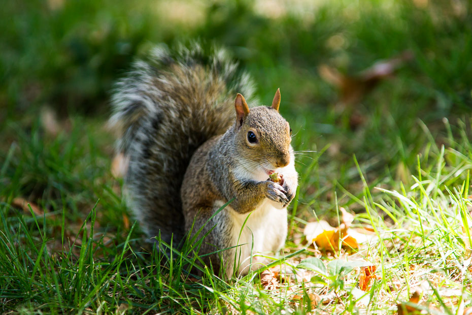
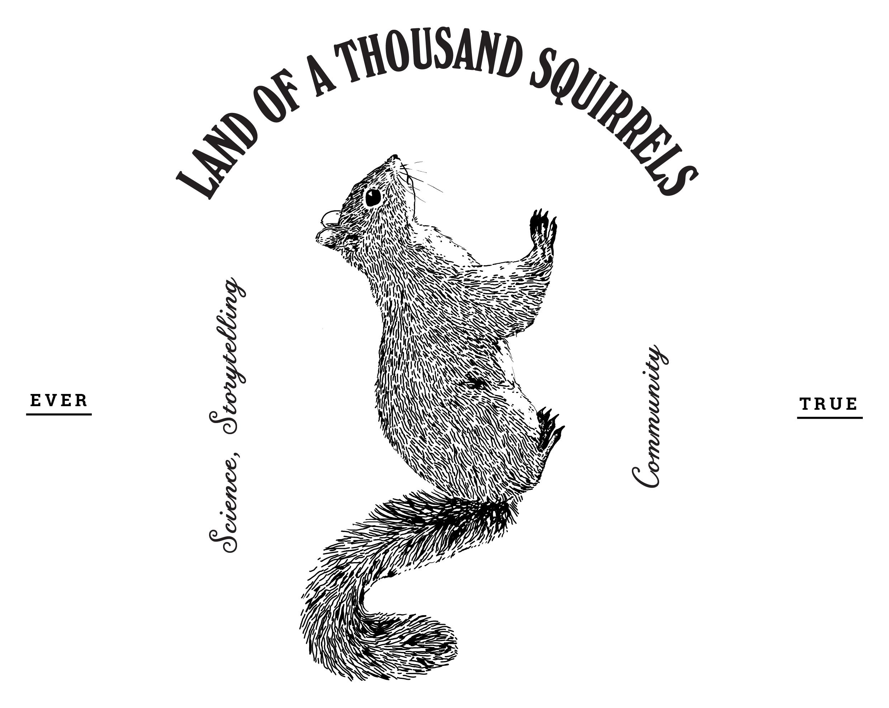

```{r setup, include=FALSE}
knitr::opts_chunk$set(echo = FALSE, warning = FALSE, message = FALSE, fig.align="center")
```

```{r}
library(ggplot2)
library(ggthemes)
library(ggmap)
library(gganimate)
library(plotly)
library(htmltools)
library(dplyr)
library(shiny)
library(shinyjs)
library(gifski)
```

```{r}
HTML(
  '<div id="intro">
				<div class="tv">
					
				</div>
				<div class="title">
					<p class="small">An analysis of NYC\'s 2018 Squirrel Census</p>
					<p class="large">A Squirrel\'s World</p>
				</div>
				</div>
				<div class = "center">
					<p class="byline"><span class="bold">Gazi Fuad</span></p>

				</div>
				<div class="lede-div">
		  <p class="prose" id="firstp">
			In New York, Squirrels are everywhere. They\'re basically New York City\'s unofficial mascot (right behind Pizza rat).
			You see them climbing up trees, munching on acorns, terrorizing tourists, and more. 
			As such, it only seemed right to conduct a survey of all squirrels to find all we can about our favorite cute little animal.
      <br><br>Thus, in the October of 2018, more than 200 volunteers descended on Central Park to conduct the 2nd most important census on American soil. Here\'s what they found:
			</div></div>"'
)
# Read in squirrel census data
data <- read.csv('2018_Central_Park_Squirrel_Census_-_Squirrel_Data.csv')

# Remove any empty values and make sure values are of correct type
data_clean <- data[!data$Primary.Fur.Color=='' & 
                     (data$Age=='Adult' | data$Age=='Juvenile') & 
                     !data$Location=='',]

data_clean$Date <- as.Date(as.character(data_clean$Date), '%m%d%Y') 
```
<div class = "center">
  
  <p> Image credits: https://www.thesquirrelcensus.com//</p>
  </div>
  
## Comparing Fur Colors

Let's start with a simple bar plot comparing the counts of squirrels by their fur color.

```{r}
# Bar plot of squirrels by fur color and age
fur_color_bar <- ggplot(data=data_clean, aes(x=Primary.Fur.Color, 
                                             fill = Primary.Fur.Color)) + 
  geom_bar(stat = 'count', show.legend = F) + facet_wrap(vars(Age)) + 
  labs(x='Primary Fur Color', y='Number of Squirrels', 
       title = 'Primary Fur Color of Squirrels in Central Park (Oct. 2018)',
       fill='Primary Fur Color') + 
  theme_clean() + scale_fill_manual(values=c('Black', '#d2691e', 'grey50'))

fur_color_bar
```

It's obvious to us very early on that (Eastern) Gray squirrels absolutely dominate and knock the other fur colors out of the park (yes, pun intended). There's almost as many juvenile Gray squirrels as there are Cinnamon squirrels. Such a huge gap in populations could be due to a variety of factors from genetics to environment, and more.

<div class = 'center'>
  
  <p> Image credits: https://www.pngitem.com/pimgs/b/113-1131451_squirrel-png.png//</p>
</div>

Let's see if there any differences come up between squirrels of different fur colors when looking at other features of our data.

## Squirrel Sightings Throughout Census Period

```{r}
# Time-series line graph of squirrel sightings by color
ggplot(data=data_clean, 
       aes(x=Date, group=Primary.Fur.Color, color=Primary.Fur.Color)) +
  geom_line(stat = 'count', lwd=1.5) + 
  scale_color_manual(values=c('Black', '#d2691e', 'grey50')) +
  labs(x='Date', y='Number of Squirrels', 
       title='Squirrel Sightings in Central Park (Oct. 2018)',
       color = 'Primary Fur Color') + theme_clean()

```

We see that there is often variation with the squirrels seen each day, possibly due to a change in the number of volunteers each day. Still, with the information we have, time does not appear to cause any surge in any particular fur color of squirrels. The sighting numbers each day generally share the same pattern each day (look at the Gray and Cinnamon lines particularly).

## The Height of Squirrels

Most of the time, the volunteers found the squirrels on the ground. There were some instances, however, where the squirrels were found looking down at the world. If the squirrel was first found above ground, their height was recorded. Maybe there is a difference in the heights squirrels are willing to go based on their fur color?

```{r}
# Subset to only include data about squirrels seen above ground
data_clean_above <- subset(data_clean, data_clean$Location == 'Above Ground' &
                             data_clean$Above.Ground.Sighter.Measurement != '')

# Boxplot of height of squirrel sighting by fur color
ggplot(data = data_clean_above, aes(x=Primary.Fur.Color, 
                                    y=as.numeric(Above.Ground.Sighter.Measurement),
                                    fill=Primary.Fur.Color)) + 
  geom_boxplot(show.legend = F) + 
  scale_fill_manual(values=c('Black', '#d2691e', 'grey50')) +
  labs(title='Boxplot of the Number of Feet Above Ground \nof Squirrel During Sighting (Oct. 2018)',
       x='Primary Fur Color',
       y='Number of Feet Above Ground', 
       fill='Primary Fur Color') + theme_clean() 

```

Nope. They all  tend to occupy the same space in the realm above. Gray squirrels were occasionally found 50 ft (or more) above ground but that may just be that there are more Gray squirrels to find in general.

## Maps of Squirrels

```{r}
# Fetching central park map
lat <- c(40.7995, 40.7642)
long <- c(-73.9455,-73.9848)
bbox <- make_bbox(long,lat,f=0.05)
centralpark <- get_map(bbox, maptype = "terrain", source = "stamen")

# Map of all squirrel sightings colored by fur color
cp_fur <- ggmap(centralpark) + geom_point(data = data_clean, 
                                aes(X,Y,color=Primary.Fur.Color, group=Date),
                                size=.75) +
  scale_color_manual(values=c('Black', '#d2691e', 'grey50')) +
  labs(title = 'Squirrel Sightings by Fur Color in Central Park (Oct. 2018)',
       color='Primary Fur Color') + theme_map() + 
  theme(legend.position = c(.7, .05))

cp_fur
```

Above, we see every single squirrel sighting (almost 3,000) during the 2-week period of the census. (Wow, that's a lot of squirrels)

<div class = 'center'>
  
  <p> Image credits: https://reveriechaser.com/squirrels-in-the-central-park/</p>
</div>

We can even animate our map to show where the squirrels were found each day...

```{r}
# Animating squirrel sightings to show sightings each day of census
cp_fur_anim <- cp_fur + labs(subtitle = '{closest_state}') + transition_states(Date)
animate(cp_fur_anim, renderer=gifski_renderer(), fps=4)
```

...and even by the morning or afternoon shift:

```{r}
# Creating new animation for AM vs PM shift
cp_fur_time <- ggmap(centralpark) + geom_point(data = data_clean,
                                          aes(X,Y,color=Primary.Fur.Color,
                                              group=Shift),
                                          size=.75) +
  scale_color_manual(values=c('Black', '#d2691e', 'grey50')) +
  labs(title = 'Squirrel Sightings by Fur Color in Central Park (Oct. 2018)',
       color='Primary Fur Color') + theme_map() +
  theme(legend.position = c(.7, .05))

cp_fur_time_anim <- cp_fur_time + labs(subtitle = 'Time: {closest_state}') +
  transition_states(Shift)
animate(cp_fur_time_anim, renderer=gifski_renderer(), fps=20)
```

From these, we can see that Cinnamon and Black squirrels tend to be found in the same areas, which makes sense. There is strength in numbers when there's not many of you. We can also observe that squirrels tend to not appear as much in open field areas such as 'The Great Lawn', 'Sheep's Meadow', and 'East Meadow.' These areas feature almost no trees (except for on the edges) and are often filled with actual humans having picnics, playing sports, etc. which sway the squirrels away.

Next, we can actually create a density heatmap to better identify the most popular squirrel congregation areas:

```{r}
# Density map of all squirrels in Central Park
ggmap(centralpark) +
  stat_density2d_filled(data = data_clean,
                 aes(X, Y, fill = ..ndensity..),
                 geom = 'tile', contour = NA, alpha = .5) +
  labs(title = 'Heatmap of Squirrel Sightings in Central Park (Oct. 2018)') +
  scale_fill_gradient("Squirrel\nDensity", low = "transparent", high = "red") +
  theme_map() +
  theme(legend.position = c(.8, .05))
```

The most popular area for squirrels in aggregate is 'The Ramble', "the most well-known of the Park's three woodland landscapes". With an abundance of trees and nuts here, it's not hard to see why it's the hottest squirrel club around.

We can separate our density heatmap by fur color too:

```{r}
# Interactive density map of squirrels by fur color
squirrel_density <- ggmap(centralpark) +
  stat_density2d_filled(data = data_clean,
                        aes(X, Y, fill = ..ndensity..,
                            frame=Primary.Fur.Color),
                        geom = 'tile', contour = NA, alpha = .5) +
  labs(title = 'Heatmap of Squirrel Sightings in Central Park (Oct. 2018)') +
  scale_fill_gradient("Squirrel\nDensity", low = "transparent", high = "red") +
  theme_map()

squirrel_density_plotly <- ggplotly(squirrel_density,
                                    width = 900, height = 700) %>%
  animation_slider(currentvalue = list(prefix = "Fur Color: "))

div(squirrel_density_plotly, align = 'center')
```

If you change the color to create the density map you'll find that Black squirrels are most commonly found near 'North Meadow', Cinnamon squirrels near the southern border of the Park, and gray squirrels near 'The Ramble'. From this, we're able to identify the various areas in the Park the squirrels have carved out for themselves. 

## Closing Remarks

<div class = 'center'>
  
  <p> Image credits: https://2016.thesquirrelcensus.com/census.html</p>
</div>

After all this analysis, what differences are there between Black, Cinnamon, and Gray squirrels in Central Park? 

Well, not much to be honest.

These squirrels all tend to have the same behavior regardless of their fur color. They tend to congregate together in different areas of the Park but this could be just due to the instinctual need/want to be around those that look like them.

So what's next?

We collect more data! For the 2018 Squirrel Census, it was limited to Central Park. In the most recent version of the survey (conducted in 2020), the locations were expanded to include various parks in the city. We can expand out of this further by including not only parks but various residential and commercial neighborhoods too. One can never count too many squirrels in New York City.

In the meantime, you can celebrate the 10th anniversary of the the Squirrel Census by scrolling through their twitter below:

<div class = 'center'>
  <a href = "https://twitter.com/SquirrelCensus/status/1509877220902326276?s=20&t=XZPLj5y9mzqS1C4P367qNQ" 
     target = "_blank">
     
  </a>
</div>

---

Image Credits:
Rotating 'Squirrel Census' Logo: https://2019.thesquirrelcensus.com/

